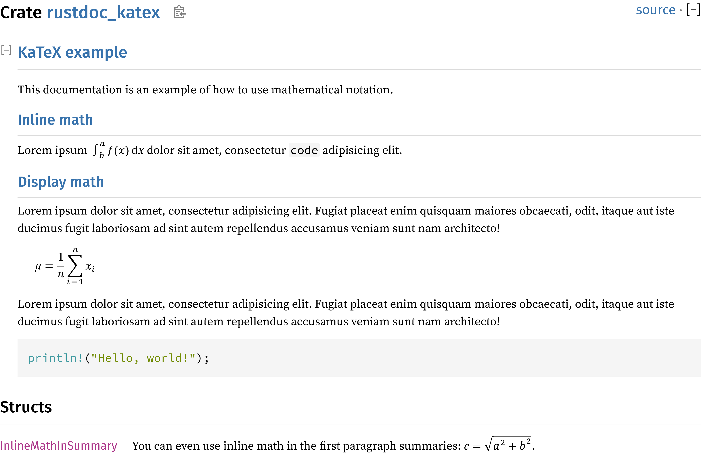

# rustdoc-katex

_rustdoc-katex_ integrates the mathematical typesetting engine for the web KaTeX
into the documentation generator for Rust projects `rustdoc`. It consists of
custom JavaScript and CSS which are injected into the generated output by
`rustdoc`, calling into the embedded KaTeX script to render the math notations
on page load.

## Installation

1. Download a release that works for your `rustdoc` version (see section
   [Version numbers](#version-numbers)).
2. Unzip the archive and copy the contents into your project directory, next to
   the manifest file:

   ```text
   <project-dir>
   ├ .cargo/
   │ ├ config.toml
   │ ├ katex-runner.html
   │ └ katex.html
   └ Cargo.toml
   ```

## Usage

KaTeX supports math notation using the format and commands from the TeX engine.
It can be rendered either inline or in “display” style.

To write math inline with other text, wrap it between `` `$ `` and `` $` ``,
like a regular code span but with added dollar signs:

```markdown
This line contains math like `$a^2 + b^2 = c^2$`.
```

There must not be any characters between the backticks (`` ` ``) and dollar
signs (`$`).

Display math creates an indented section in the documentation for a single
equation to stand out. It is written in Markdown using a fenced code block with
an info string of `math`:

````markdown
```math
\mu = \frac{1}{n} \sum^n_{i=1} x_i
```
````

The following screenshot was taken from the documentation output of the
[lib.rs](./src/lib.rs) file:



## Version numbers

The version number of _rustdoc-katex_ is composed of the embedded KaTeX's
version, the minimum supported `rustdoc` version and a revision number:

```text
<katex>-<rustdoc>-<revision>
```

For example, _rustdoc-katex_ v1.2.3-6.7.8-0 would integrate KaTeX v1.2.3 into
rustdoc v6.7.8 and later, while being the first revision to do so.

The revision number starts at 0 and is increased for bug fixes.
